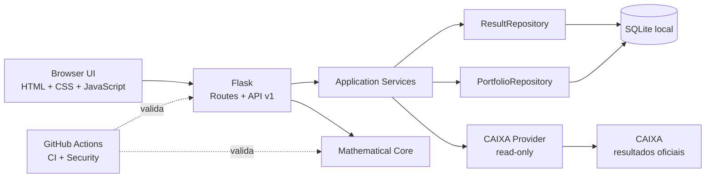

# ADR-0001 — Arquitetura do MVP V2 e estratégia de evolução

- **Status:** Aceita
- **Data:** 2026-08-17
- **Escopo:** MVP V2, beta fechado/local e preparação para futura decisão de beta público

## Contexto

O MegaSena Intelligence é um laboratório de estratégias de loteria para Mega-Sena,
Lotofácil, Quina e Dia de Sorte. O MVP V2 inclui planejamento por orçamento,
comparação de estruturas, restrições experimentais, histórico, backtest walk-forward,
carteiras salvas, conferência de resultados, exportação e jogo responsável.

Três fronteiras devem permanecer explícitas:

1. resultado oficial não é carteira do usuário;
2. análise histórica não é previsão;
3. copiar, exportar ou abrir a página da CAIXA não registra aposta.

## Decisão

Manter no beta fechado/local um **monólito modular Flask**, com separação por API,
serviços, núcleo matemático, repositories e providers. Não introduzir microserviços,
Kafka, Redis ou Kubernetes sem requisito operacional mensurável.



### Interface web

A UI usa JavaScript sem framework e cobre planner, restrições, histórico, backtest,
carteiras salvas, conferência e exportação. O Bearer token fica somente no
formulário/memória da página.

Erros estruturados da API devem virar mensagens acionáveis. O frontend **não deve
descartar `error.details`** e reduzir um erro de domínio a `Request validation failed.`.

### API

`/api/v1` é a fronteira versionada. Ela valida payloads, preserva códigos de erro,
autentica rotas e coordena serviços e matemática. Contratos devem manter a distinção
entre probabilidade teórica, frequência histórica e resultado de backtest.

### Núcleo matemático

- combinatória exata quando viável;
- seed reproduzível;
- walk-forward sem dados futuros;
- baseline uniforme obrigatório;
- `SEM EVIDÊNCIA DE VANTAGEM` quando o critério estatístico não for atendido;
- soma, paridade, repetição e sobreposição são filtros estruturais, não preditivos.

### Persistência

No beta local, SQLite permanece padrão. Resultados oficiais e carteiras ficam em
domínios/tabelas separados e repositories isolam persistência da regra de negócio.

Para ambiente público/compartilhado, PostgreSQL é a evolução preferencial, condicionada
a uma ADR específica sobre identidade, autorização, migrations, backup e retenção.

### Integração CAIXA

O provider é **somente leitura** para resultados/metadados. Ficam fora do escopo:
login automatizado, compra, envio de aposta, reverse engineering transacional ou
qualquer fluxo de dinheiro real sem API/parceria/autorização oficial.

### Autenticação

O beta local usa Bearer token configurado no servidor. Um token compartilhado não é
arquitetura aceitável para beta público multiusuário.

### Qualidade e segurança

Gate mínimo do candidato:

```bash
python -m ruff check .
pytest -q
node --check app/static/app.js
python -m pip_audit -r requirements.txt
git diff --check
```

CI e Security do GitHub devem estar verdes no mesmo commit. Segredos ficam fora do
Git e telemetria não deve conter token, dezenas de carteiras ou dados pessoais
sem necessidade.

## Consequências

### Positivas

- baixa complexidade operacional;
- testes locais rápidos;
- fronteiras de domínio claras;
- evolução de persistência via repository;
- matemática testável sem servidor HTTP;
- evita infraestrutura distribuída prematura.

### Trade-offs

- Flask + SQLite local não atendem sozinhos concorrência e isolamento multiusuário;
- frontend sem framework exige disciplina para evitar duplicação;
- processo único não oferece alta disponibilidade;
- notificações e sincronização periódica ainda precisam de desenho operacional.

## Alternativas rejeitadas nesta fase

- **Microserviços:** complexidade sem necessidade de deploy/escala independente.
- **Kafka/Redis:** sem throughput ou workflow assíncrono que justifique agora.
- **Kubernetes:** sem requisito operacional atual.
- **IA generativa para prever dezenas:** fora do escopo e incompatível com o produto.
- **Automação transacional com a CAIXA:** fora do escopo sem integração oficial/legal.

## Próximos passos

### P0 — Fechar beta local

1. concluir smoke visual ponta a ponta;
2. corrigir falhas de UX encontradas no smoke;
3. adicionar E2E de navegador aos fluxos críticos;
4. manter regressões de acessibilidade, mobile e mensagens de erro;
5. registrar bugs sem dados sensíveis.

### P1 — Gate para beta público

Criar ADRs específicas para:

1. identidade, login e autorização por usuário;
2. SQLite → PostgreSQL e migrations;
3. runtime WSGI de produção, HTTPS e gestão de segredos;
4. rate limiting e proteção de abuso;
5. observabilidade, métricas, logs e alertas;
6. backup/restore e recuperação de desastre;
7. retenção/exclusão de dados e LGPD;
8. revisão jurídica final de Termos e Privacidade.

O beta público não deve começar enquanto esses gates estiverem indefinidos.

### P2 — Acompanhamento automático

Após os gates de usuário/persistência: sincronização programada de resultados,
conferência automática, notificações opt-in, idempotência e trilha de auditoria.
Começar com scheduler/job simples; fila distribuída somente se volume ou garantias
de entrega exigirem.

### P3 — Evolução analítica

Se benchmarks demonstrarem gargalo, avaliar DuckDB + Parquet + Polars para OLAP
local, mantendo PostgreSQL como transacional e preservando contratos matemáticos.

### P4 — Cloud e escala

Preferir inicialmente:

```text
1 aplicação containerizada
        +
PostgreSQL gerenciado
        +
HTTPS / secret manager / observabilidade
```

Kubernetes somente quando houver necessidade real de múltiplos serviços, escala
independente ou padronização de plataforma.

## ADRs futuras sugeridas

- ADR-0002 — Identidade e autorização multiusuário
- ADR-0003 — PostgreSQL e migrations
- ADR-0004 — Runtime/topologia de produção
- ADR-0005 — Sincronização de resultados e notificações
- ADR-0006 — Retenção, privacidade e LGPD
- ADR-0007 — Camada analítica OLAP, se benchmarks justificarem

## Critério de revisão

Revisar esta ADR quando houver beta público aprovado, usuários concorrentes,
gargalo medido de persistência, necessidade de garantias assíncronas, múltiplos
serviços independentes ou integração transacional oficial.
